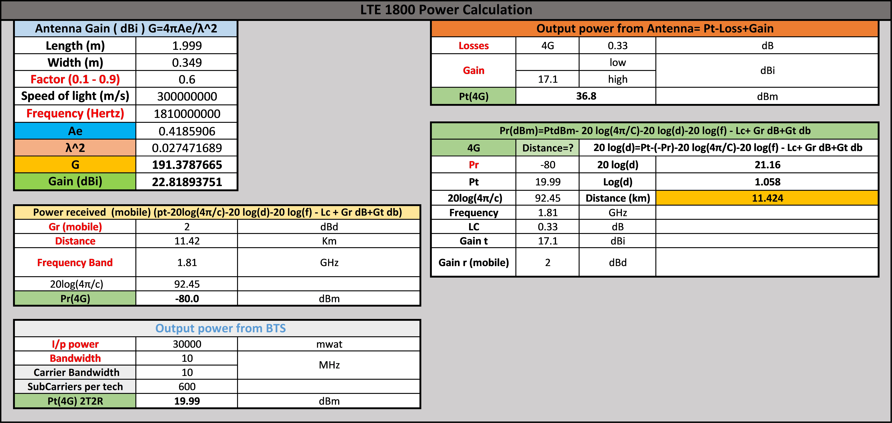
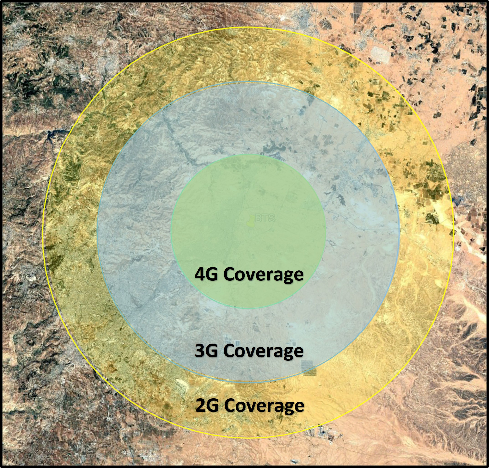
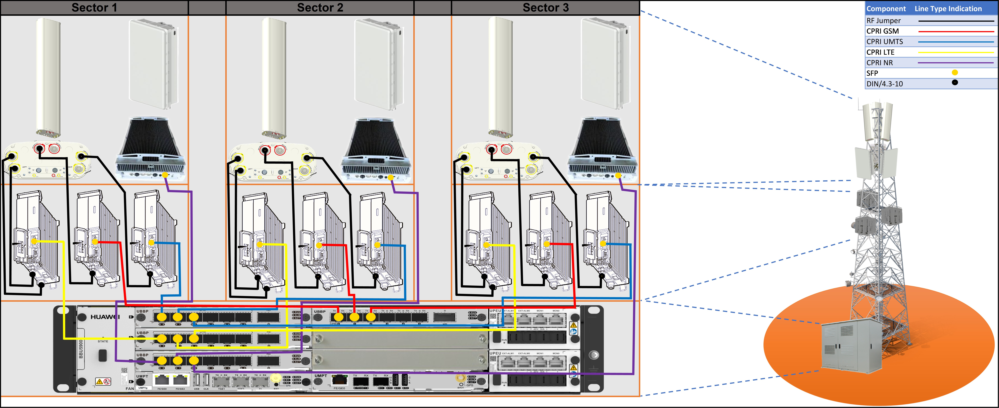
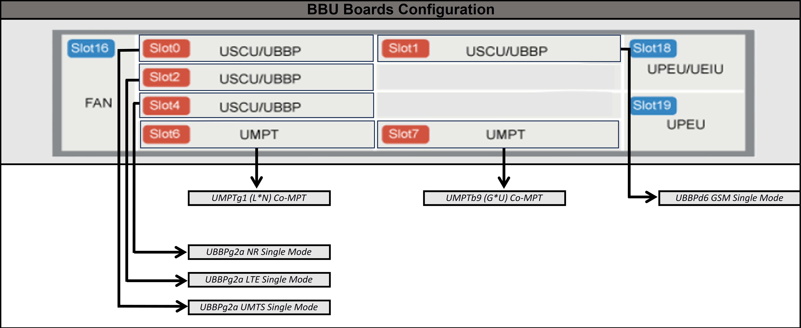
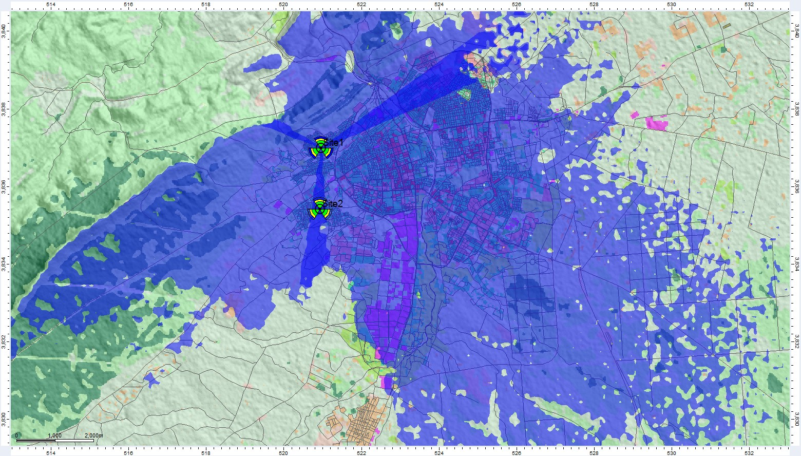
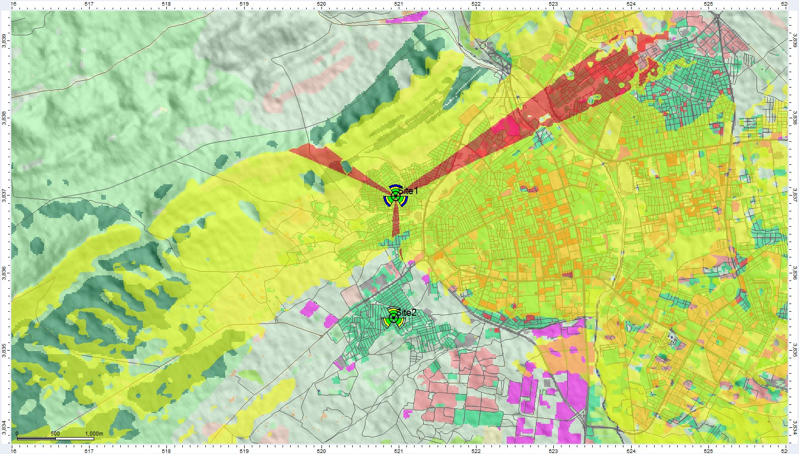
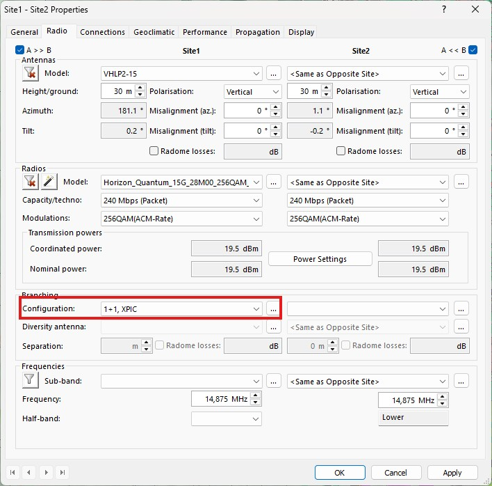

# Integrated Telecommunication in (Mobile Wireless Communication, Optical Fiber Transmission, Microwave Transmission, and RF-Planning)

## Introduction

 This repository contains a <b>proof-of-concept project</b> completed during my participation in the <b>Integrated Telecommunication Engineering Program</b>. The goal of this project was to demonstrate my capability to <b>design and implement telecommunication networks</b> based on specific <b>Key Performance Indicators (KPIs)</b> and technical requirements provided by my instructor. 

The work covers <b>three core domains</b> of telecommunications:
<ul>
  <li><b>Mobile Wireless Communication</b> – Equipment selection, RF planning and network simulation using Forsk Atoll software.</li>
  <li><b>Optical Fiber Transmission</b> – Selection and documentation of suitable equipment for high-capacity links.</li>
  <li><b>Microwave Transmission</b> – Simulation and planning using Forsk Atoll software of point-to-point connections for reliable backhaul.</li>
</ul>

 Using <b>Huawei components</b> as the reference hardware, I evaluated technical options, selected optimal equipment, and prepared detailed documentation. The mobile wireless and microwave segments were further validated through simulation to ensure alignment with the project’s KPIs and operational requirements. 

 This project serves as evidence of my skills in <b>network design, equipment specification, documentation, and simulation-based planning</b> across multiple telecommunication domains. 

## <h2>Project Plan</h2>

The project is organized into four phases, each addressing a key domain of the telecommunication network: 

<ol>
  <li><b><a href="#mobile-wireless">Mobile Wireless Communication</a></b></li>
  <li><b><a href="#optical-fiber">Optical Fiber Transmission</a></b></li>
  <li><b><a href="#microwave">Microwave Transmission</a></b></li>
  <li><b><a href="#atoll-forsk">Atoll Forsk Simulation</a></b></li>
</ol>

The general workflow for each phase follows these steps:

<b>Collecting Requirements → Studying Technical Aspects → Choosing Components → Implementation & Connection → Deliverables</b>

<ol>
  <li><b>Collecting Requirements</b></li>
  
This step is based on <b>Key Performance Indicators (KPIs)</b> and <b>strategic goals</b> of the intended telecom network. In this project, the requirements were provided by the instructor to simulate a real-world scenario. 

  <li><b>Studying Technical Aspects</b></li>
  
This phase involves reviewing relevant technical information, network standards, and design considerations. The goal is to ensure a solid technical foundation before moving to the design stage. 

  <li><b>Choosing Components</b></li>
  
Based on the requirements, appropriate <b>Huawei components</b> and other network elements are selected. This stage relies heavily on <b>datasheets</b> to evaluate technical specifications, compatibility, and performance. 

  <li><b>Implementation & Connection</b></li>
  
This includes <b>schematic designs, topology diagrams</b>, and establishing connections between components. For mobile wireless and microwave phases, simulations are carried out in <b>Forsk Atoll</b> to validate network performance. 

  <li><b>Deliverables</b></li>
  
<b>Final outcomes</b> prepared for handover to other engineering or operations teams including <b>Bill of Quantities (BOQs)</b>. 

</ol>

## Project Phases
### <h3 id="mobile-wireless">Phase 1: Mobile Wireless Communication</h3>

In this phase, we focused on designing mobile networks for <b>2G (GSM)</b>, <b>3G (UMTS)</b>, <b>4G (LTE)</b>, and <b>5G (NR)</b> technologies using the <b>Huawei BBU 5900</b> as the central baseband unit. We began by performing <b>power calculations</b> for GSM, UMTS, and LTE to determine the expected coverage areas based on link budget analysis. After validating the design parameters, we proceeded with the network layout and concluded the phase with a site survey to assess real-world deployment feasibility. 

### <ins>Power Calculations</ins>

##### <ins><i>Requirements</i></ins>

  

##### <ins><i>Calculations & Results</i></ins>

  

  

  

##### <ins><i>Coverage Area</i></ins>

  

### <ins>Project Design</ins>
##### <ins><i>Requirements</i></ins>

  

##### <ins><i>Technical Aspects</i></ins>
To prepare for the mobile network design, I studied relevant <b>Huawei documentation</b> and key mobile communication concepts, focusing on:
<ul>
  <li><b>Huawei BBU 5900 Documentation</b> – Specifications, configuration, and integration for multi-technology deployments.</li>
  <li><b>MIMO (Multiple Input Multiple Output)</b> – Principles, configurations, and benefits in LTE and 5G.</li>
  <li><b>Spatial Diversity</b> – Techniques to improve signal robustness and minimize fading.</li>
  <li><b>Mobile Technologies Overview</b> – GSM, UMTS, LTE, and NR (5G) standards, supported bands, and spectrum allocation.</li>
  <li><b>Multiple Access Techniques</b> – FDMA (GSM), WCDMA (UMTS), OFDMA (LTE/5G), SC-FDMA (LTE uplink).</li>
  <li><b>Link Budget Analysis</b> – Power calculations for GSM, UMTS, and LTE to estimate coverage areas.</li>
  <li><b>Antenna Types & Configurations</b> – Sectorized antennas, omnidirectional antennas, and beamforming in LTE/5G.</li>
  <li><b>Propagation Considerations</b> – Path loss models applicable to urban, suburban, and rural environments.</li>
  <li><b>KPI-Driven Design</b> – Coverage, capacity, throughput, and mobility performance as per project requirements.</li>
</ul>
This technical background ensured the mobile wireless design met the <b>coverage and performance KPIs</b> while optimizing component selection and configuration.

##### <ins><i>Components</i></ins>

  

  

  

  

  

  

  

  

  

##### <ins><i>Implementation & Connection</i></ins>

  

  

##### <ins><i>Deliverables</i></ins>

  

Design is ready to be handed over. 

### <h3 id="optical-fiber">Phase 2: Optical Fiber Transmission</h3>

In this phase, we designed a <b>DWDM OTN (Dense Wavelength Division Multiplexing – Optical Transport Network)</b> to interconnect two countries, ensuring high-capacity and long-distance transmission. The solution was implemented using <b>Huawei OSN 9800</b> equipment, selected for its scalability and performance. In addition to meeting current capacity requirements, the design also incorporated a <b>future growth</b> plan to enable seamless capacity upgrades if traffic demand increases, ensuring long-term network reliability and flexibility. 

### <ins>Project Design</ins>
##### <ins><i>Requirements</i></ins>

  

##### <ins><i>Technical Aspects</i></ins>
To prepare for the optical fiber network design, I studied <b>Huawei documentation</b> related to the <b>OSN 9800</b> platform and key optical transmission principles, including:
<ul>
  <li><b>Huawei OSN 9800 Documentation</b> – Equipment specifications, configuration guidelines, and scalability features for DWDM/OTN deployments.</li>
  <li><b>Optical Transport Network (OTN)</b> – Concepts, architecture, and standard framing structure.</li>
  <li><b>MS-OTN (Multi-Service OTN)</b> – Integration of multiple service types (Ethernet, SDH, etc.) over a single optical infrastructure.</li>
  <li><b>Liquid OTN</b> – Flexible OTN architecture for dynamic service provisioning and network optimization.</li>
  <li><b>Optical Fiber Bands</b> – Characteristics and applications of <b>C-band</b>, <b>S-band</b>, and <b>L-band</b> in DWDM systems.</li>
  <li><b>ROADM (Reconfigurable Optical Add-Drop Multiplexer)</b> – Operating principles, fixed-grid vs. flex-grid, and colorless/directionless/contentionless (CDC) configurations.</li>
  <li><b>Fiber Optic Network Protection Schemes</b> – 
    <ul>
  <li>Line-side protection (1+1, 1:1)</li>
  <li>Client-side protection</li>
  <li>Intra-board protection</li>
    </ul>
  </li>
  <li><b>Fiber Loss Calculation</b> – Attenuation, splice loss, connector loss, and system margin calculations.</li>
  <li><b>Dispersion Management</b> – Chromatic and polarization mode dispersion control in long-haul transmission.</li>
  <li><b>Amplification Techniques</b> – Use of EDFAs (Erbium-Doped Fiber Amplifiers) and Raman amplification in DWDM.</li>
  <li><b>KPI Considerations for Optical Networks</b> – Latency, BER (Bit Error Rate), and availability targets.</li>
</ul>
This technical preparation ensured the DWDM OTN design was <b>high-capacity, resilient, and future-proof</b>, meeting current requirements and allowing for seamless upgrades.

##### <ins><i>Components</i></ins>

  

  

  

  

  

  

  

  

  

##### <ins><i>Implementation & Connection</i></ins>

  

  

##### <ins><i>Deliverables</i></ins>

  

Design is ready to be handed over. 

### <h3 id="microwave">Phase 3: Microwave Transmission</h3>

In this phase, we designed a <b>point-to-point (PTP) microwave link</b> using the <b>Huawei RTN 950A</b>, targeting high-capacity backhaul connectivity with robust reliability. The design incorporated a <b>1+1 Hot Standby (HSB)</b> configuration for redundancy and <b>XPIC (Cross-Polarization Interference Cancellation)</b> technology to double capacity without additional spectrum usage. This approach ensured both high performance and network resilience under various operating conditions. 

### <ins>Project Design</ins>
##### <ins><i>Requirements</i></ins>

  

##### <ins><i>Technical Aspects</i></ins>
To prepare for the microwave link design, I studied <b>Huawei documentation</b> related to the <b>RTN 950A platform</b> and fundamental microwave transmission concepts, including:
<ul>
  <li><b>Huawei RTN 950A Documentation</b> – Specifications, configuration procedures, and integration guidelines for high-capacity microwave links.</li>
  <li><b>Microwave Transmission Principles</b> – Fundamentals of point-to-point communication, modulation schemes, and line-of-sight requirements.</li>
  <li><b>Path Loss and Link Budget Calculation</b> – Free space path loss, atmospheric attenuation, rain fade, and system gain analysis.</li>
  <li><b>Microwave Frequency Bands</b> – Characteristics and applications of common bands such as 6 GHz, 11 GHz, 18 GHz, and 23 GHz.</li>
  <li><b>Protection Configurations</b> – 
    <ul>
  <li>1+1 Hot Standby (HSB)</li>
  <li>1+1 Space Diversity (SD)</li>
  <li>1+1 Frequency Diversity (FD)</li>
    </ul>
  </li>
  <li><b>XPIC (Cross-Polarization Interference Cancellation)</b> – Method for doubling capacity using dual-polarization without additional spectrum.</li>
  <li><b>Fade Margin Analysis</b> – Ensuring link availability under worst-case conditions.</li>
  <li><b>Antenna Selection</b> – Criteria for dish size, gain, and beamwidth based on link requirements.</li>
  <li><b>Multipath Mitigation</b> – Techniques to minimize interference from reflections and scattering.</li>
  <li><b>KPI Considerations</b> – Throughput, latency, availability, and resilience for critical backhaul applications.</li>
</ul>
This knowledge enabled the design of a <b>high-capacity, redundant, and spectrum-efficient microwave link</b> meeting both performance and reliability targets.

##### <ins><i>Components</i></ins>

  

  

  

  

  

  

  

##### <ins><i>Implementation & Connection</i></ins>

  

##### <ins><i>Deliverables</i></ins>

  

Design is ready to be handed over. 

### <h3 id="atoll-forsk">Phase 4: Atoll Forsk Simulation</h3>

In this phase, we used <b>Atoll</b>, a professional radio planning and optimization software, to conduct network simulations based on the project requirements. The simulation included the implementation of <b>two sites (cells)</b>, each supporting <b>multi-RAT technologies (2G/3G/4G/5G)</b>, with a <b>microwave link</b> designed between them to provide reliable backhaul connectivity. This phase allowed us to validate coverage, capacity, and link performance through practical modeling in Atoll. 

##### <ins><i>Requirements</i></ins>

  

<b>Note:</b> The design was carried out using Atoll version 3.4. The full project is uploaded in this repository for further result exploration. In this phase, only the key design aspects and main outcomes are presented. 

### <ins>Cellular Design</ins>

Color code for this section: (Blue → GSM, Yellow → UMTS, Green → LTE, Red → Overlapping Zones) 

##### <ins><i>Schematic</i></ins>

  

##### <ins><i>Sites Configuration</i></ins>

  

<i>Example for an GSM Sector</i>
  

  

<i>Example for an UMTS Sector</i>
  

  

<i>Example for an LTE Sector</i>
  

##### <ins><i>Results</i></ins>

  

<i>Coverage by Transmitter Site 1 GSM</i>
  

  

<i>Overlapping Zones Site 1 GSM</i>
  

  

<i>Coverage by Transmitter Site 1 UMTS</i>
  

  

<i>Overlapping Zones Site 1 UMTS</i>
  

  

<i>Coverage by Transmitter Site 2 UMTS</i>
  

  

<i>Coverage by Transmitter Site 1 LTE</i>
  

  

<i>Overlapping Zones Site 1 LTE</i>
  

  

<i>Coverage by Transmitter Site 2 UMTS</i>
  

  

<i>Coverage by Signal Level Site 1 GSM</i>
  

  

<i>Coverage by Signal Level Site 1 UMTS</i>
  

  

<i>Coverage by Signal Level Site 2 UMTS</i>
  

  

<i>Coverage by Signal Level Site 1 LTE</i>
  

  

<i>Coverage by Signal Level Site 2 LTE</i>
  

  

<i>UMTS Point Analysis</i>
  

  

<i>LTE Point Analysis</i>
  

### <ins>Microwave Design</ins>

##### <ins><i>Schematic</i></ins>

  

##### <ins><i>Sites Configuration</i></ins>

  

  

##### <ins><i>Results</i></ins>

  

  

## Conclusion

This project, conducted as part of the <b>Integrated Telecommunication Engineering Program</b>, demonstrates my ability to design and plan telecommunication networks across multiple domains. Through <b>Mobile Wireless Communication, Optical Fiber Transmission, Microwave Transmission, and Atoll Simulation</b>, I applied both theoretical knowledge and practical tools to create a proof-of-concept network design. 

By working with <b>Huawei components</b> and following <b>KPI-driven requirements</b>, I gained hands-on experience in equipment selection, link budget calculations, capacity planning, protection schemes, and simulation-based validation. Each phase showcased a different aspect of telecom engineering, from <b>radio access design and fiber backbone planning to microwave backhaul and network optimization tools</b>. 

This repository serves as evidence of my technical competence, problem-solving ability, and readiness to contribute to real-world <b>telecommunication network design and implementation projects</b>, while also providing a foundation for future professional growth in this field. 

--------------------------------------------------------------------------------------------

### Contact Information
**Mohammad Ibrahim Al-Asaslih**  
  Email: [mohammad.asaslih@gmail.com](mailto:mohammad.asaslih@gmail.com)  
  LinkedIn: <a href="https://www.linkedin.com/in/mohammad-al-asaslih">Mohammad Al-Asaslih</a>
  
--------------------------------------------------------------------------------------------
### 
Good Luck

